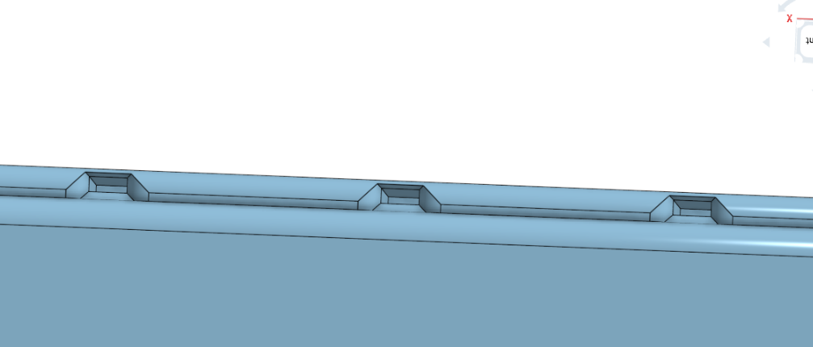
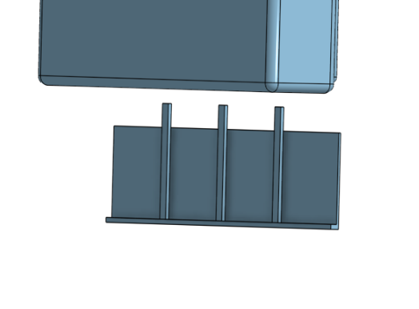
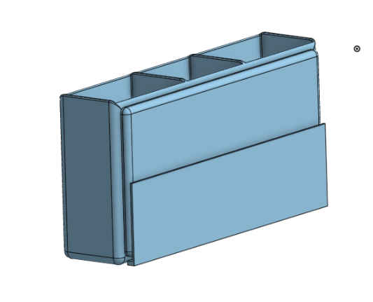
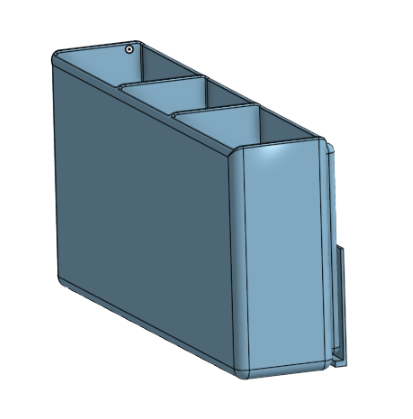

# RemoteWallMount

A 3d print to hold remotes that are roaming around in my house ;<
No electronical parts needed just a 3d printer

# CAD IMAGES

# BOM 

## Bill of Materials (BOM)

| Item | Category  | Description        | Qty | Unit Price (USD) | Total (USD) |
|-----:|-----------|--------------------|----:|-----------------:|------------:|
| 1 | PRINT LEGION | Printed Parts | 1 | 0.00 | 0.00 |
| 2 | Shipping | Approx. Shipping | 1 | 15.00 | 15.00 |

**Subtotal: $15.00**

